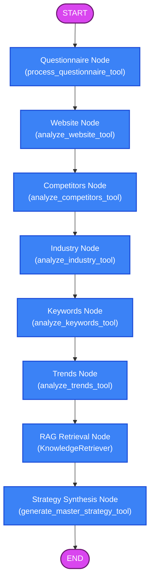

# MarketingGPT Technical Specification & System Architecture

MarketingGPT is an advanced, production-grade, multi-agent AI marketing intelligence platform. Built with a clean, decoupled architecture, it ingests raw business parameters and onboarding answers, crawls websites and competitor channels, performs normalized keyword opportunity scoring and search velocity analysis, retrieves contextual market knowledge via a vector database, and synthesizes these inputs into a comprehensive, structured marketing strategy.

This document serves as the absolute technical specification and system architecture reference for the platform.

---

## 1. System Architecture Overview

MarketingGPT conforms to the principles of **Clean Architecture** and **Domain-Driven Design (DDD)**. The system is layered to enforce a unidirectional dependency flow: outer layers (e.g., REST APIs, LangGraph workflows, CLI scripts) depend on inner layers (Services, Core Tool Analyzers), but inner layers have zero knowledge of outer integrations.

```
                  +----------------------------------------------+
                  |           LangGraph Agent Workflows          |
                  |                       &                      |
                  |                FastAPI REST endpoints        |
                  +----------------------+-----------------------+
                                         |
                                         v
                  +----------------------------------------------+
                  |         LangChain Tool Wrapper Layer         |
                  +----------------------+-----------------------+
                                         |
                                         v
                  +----------------------------------------------+
                  |            Orchestration Services            |
                  |              (StrategyService)               |
                  +----------------------+-----------------------+
                                         |
                                         v
                  +----------------------------------------------+
                  |        Domain Services (Exception Boundaries)|
                  |     (Website, Competitor, Industry, etc.)    |
                  +----------------------+-----------------------+
                                         |
                                         v
                  +----------------------------------------------+
                  |             Core Tool Analyzers              |
                  |      (SEO Scraper, Keyword Ranker, etc.)     |
                  +----------------------------------------------+
```

---

## 2. Core Analyzers (The "Tools" Layer)

Located in [app/tools/](file:///c:/Users/arghy/Desktop/MarketingGPT/marketinggpt/app/tools/), these modules are focused, side-effect-free (or restricted scraping) data processors that implement the core marketing math and heuristics.

### A. Website SEO Analyzer (`app/tools/website_analyzer.py`)
Fetches raw HTML pages using `requests` (with desktop User-Agent spoofing) and parses them with `BeautifulSoup4` using the `lxml` parser.
* **Alt-Text Coverage Algorithm**: Scans all `` tags. Alt-text coverage is calculated as:
  $$\text{Coverage \%} = \left( \frac{\text{images with alt-text attribute}}{\text{total images}} \right) \times 100$$
* **CTA Detection Algorithm**: Counts standard HTML `<button>` elements, plus `<a>` anchor tags whose text contains call-to-action keywords (`buy`, `sign up`, `get started`, `contact`, `subscribe`, `download`, `register`, `join`) or whose class string contains `btn` or `button`.
* **SEO Score Formula**: Evaluated on a scale from 0 to 100, where each of the following criteria contributes $+20$ points:
  1. Presence of a valid page `<title>` tag.
  2. Presence of a valid `<meta name="description">` or `<meta property="og:description">` tag.
  3. Presence of at least one `<h1>` header tag.
  4. Alt-text coverage percentage $\ge 80\%$.
  5. Presence of at least one internal link and at least one detected CTA.

### B. Competitor Analyzer (`app/tools/competitor_analyzer.py`)
Scrapes URLs of direct competitors.
* Extracts value propositions by parsing heading tags (`h1`, `h2`) and meta tags.
* Gathers offers, discounts, pricing indicators, and CTAs.
* Uses heuristic logic to infer the competitor's dominant go-to-market motion:
  * **Product-Led Growth (PLG)**: Inferred if the competitor prominently advertises "free trial", "freemium", "try for free", or "start free".
  * **Sales-Led Growth (SLG)**: Inferred if call-to-actions are dominated by "book a demo", "contact sales", "request pricing", or "talk to an expert".

### C. Industry Analyzer (`app/tools/industry_analyzer.py`)
Utilizes a static rule-based mapping engine that aligns a target industry vertical (e.g., `SaaS`, `Ecommerce`, `Healthcare`, `Finance`, `Real Estate`) to standardized:
* **Common Channels**: e.g., LinkedIn Ads & Content Marketing for B2B SaaS, Instagram/TikTok Ads & Influencer Marketing for Ecommerce.
* **Standard Lead Offers**: e.g., Free Trial/Whitepapers for SaaS, Discount Code/Free Shipping for Ecommerce, Free Consultations for Real Estate.
* **Conversion Benchmarks**: Expected conversion rate metrics (e.g., 2-3% for Ecommerce, 5-10% for SaaS trial signups).

### D. Keyword Opportunity Scoring Engine (`app/tools/keyword_detector.py`)
Ingests a list of keywords along with search volume, PPC competition/difficulty, CPC (cost per click), trend growth, and intent score.
* **Metric Normalization**: Standardizes all scores dynamically between `0.0` and `1.0` using min-max scaling to ensure that outsized metrics (like a search volume of 50,000 vs. a CPC of $1.50) do not disproportionately bias the result:
  $$\text{Normalized Value} = \frac{\text{Value} - \text{Min}}{\text{Max} - \text{Min}}$$
  *To prevent division-by-zero errors when difficulty normalized to 0.0, difficulty is clamped to a minimum value of `0.01`.*
* **Opportunity Score Formula**:
  $$\text{Opportunity Score} = \frac{\text{Search Volume}_{\text{norm}} \times \text{Trend Growth}_{\text{norm}} \times \text{Intent Score}_{\text{norm}}}{\text{Difficulty}_{\text{norm}}}$$
* **Sorting Heuristic**: Returns a ranked list ordered by descending opportunity score. Ties are resolved by descending search volume, then ascending difficulty, then alphabetically by keyword.

### E. Trend Analyzer (`app/tools/trend_analyzer.py`)
Interfaces with keyword search volume data to detect velocity. It is configured to run calculations over historical datasets (or mocks google trends via `pytrends` package) to determine if a keyword's search volume exhibits a positive growth vector (rising trends).

---

## 3. Data Ingestion & Onboarding Pipeline

Before analysis can proceed, raw qualitative data about the business must be captured and parsed.

```
  +--------------------------------+
  |  data/marketing_questions.docx |  (Raw MS Word Doc)
  +----------------+---------------+
                   |
                   |  (Parsed by python-docx in question_converter.py)
                   v
  +--------------------------------+
  | app/config/questions.json      |  (Structured JSON Config with Categories)
  +----------------+---------------+
                   |
                   |  (Validated against QuestionnaireService via Pydantic)
                   v
  +--------------------------------+
  | app/models/BusinessProfile     |  (Structured, exception-safe data model)
  +--------------------------------+
```

### A. Questionnaire Converter (`app/utils/question_converter.py`)
Reads `data/marketing_questions.docx` using `python-docx`. It iterates through the document, filters empty lines, and groups paragraphs into logical blocks.
* **Category Auto-Detection**: Whenever a line contains bold or uppercase headings, it registers a new category (e.g., "Company Info", "Target Audience").
* **Type Inferences**: Scans question text for patterns to assign the input type:
  * Contains "website", "URL", "link" $\rightarrow$ `url`
  * Contains "email", "contact" $\rightarrow$ `email`
  * Default type $\rightarrow$ `text`
* **JSON Generation**: Outputs a structured config file to [app/config/marketing_questions.json](file:///c:/Users/arghy/Desktop/MarketingGPT/marketinggpt/app/config/marketing_questions.json).

### B. Questionnaire Service (`app/services/questionnaire_service.py`)
Validates user-submitted questionnaires. It loads `marketing_questions.json`, matches submitted keys, ensures all required questions are answered, and structures the output into a validated `BusinessProfile` entity.

---

## 4. The Service Layer (Clean Architecture Boundaries)

Located in [app/services/](file:///c:/Users/arghy/Desktop/MarketingGPT/marketinggpt/app/services/), this layer acts as an **exception boundary** and **dependency injection** wrapper around the raw tool analyzers.

Every service (e.g., `WebsiteService`, `CompetitorService`, `KeywordService`, `TrendService`, `IndustryService`) wraps its underlying tool execution in `try-except` blocks. If a network scraper fails, the service:
1. Logs the detailed exception.
2. Gracefully falls back to a standardized default payload (preventing a website timeout from crashing the whole pipeline).
3. Ensures strict typings are preserved.

---

## 5. Centralized Strategy Orchestration

The platform's rule-based heuristic core resides in [app/services/strategy_service.py](file:///c:/Users/arghy/Desktop/MarketingGPT/marketinggpt/app/services/strategy_service.py).

```python
class StrategyService:
    """Central orchestration engine combining all analysis modules."""
    def generate_strategy(self, request: StrategyRequest) -> StrategyResponse:
        ...
```

When triggered:
1. It calls the `WebsiteService` to extract the primary website metrics.
2. It invokes the `CompetitorService` on all direct competitors.
3. It infers the target industry from the business profile answers and requests the `IndustryService` mapping.
4. It calls `KeywordService` and `TrendService` on target terms.
5. **Cross-Domain Correlation**:
   * If the competitor landscape is dominantly **Product-Led**, it recommends adding a "Free Trial" tier.
   * If the competitor landscape is **Sales-Led**, it suggests optimizing CTAs for demo bookings.
   * If the business's `seo_score` is $< 50$, it inserts a warning: *"Prioritize technical SEO fixes before scaling paid acquisition."*
   * It blends the industry-standard channels with keyword rankings to provide a prioritized acquisition checklist.

---

## 6. REST API Endpoint Specification (FastAPI)

All endpoints are built using `APIRouter`, utilize Pydantic v2 data models for input validation/output serialization, and leverage FastAPI dependency injection (`Depends()`).

### Endpoint Directory

| Route | Method | Description | Input Schema | Output Schema |
| :--- | :--- | :--- | :--- | :--- |
| `/health` | `GET` | System health check | None | `HealthResponse` |
| `/api/questionnaire/submit` | `POST` | Validates and submits onboarding questionnaire | `QuestionnaireSubmission` | `BusinessProfile` |
| `/api/website-analysis` | `POST` | Crawls website and extracts SEO metrics | `WebsiteAnalysisRequest` | `SEOAnalysisResult` |
| `/api/competitor-analysis` | `POST` | Scrapes competitors to assess CTAs and strategy | `CompetitorAnalysisRequest` | `CompetitorSummary` |
| `/api/industry-analysis` | `POST` | Returns standard industry marketing vectors | `IndustryAnalysisRequest` | `IndustryData` |
| `/api/keywords/rank` | `POST` | Runs min-max normalized opportunity scoring | `KeywordRankRequest` | `KeywordRankResponse` |
| `/api/trends/analyze` | `POST` | Gauges keyword search velocity over time | `TrendAnalysisRequest` | `TrendAnalysisResponse` |
| `/api/marketing-strategy` | `POST` | Executes master orchestrated strategy generation | `StrategyRequest` | `StrategyResponse` |

---

## 7. Retrieval-Augmented Generation (RAG) Scaffold

Located in [app/rag/](file:///c:/Users/arghy/Desktop/MarketingGPT/marketinggpt/app/rag/), this module handles loading static marketing knowledge or documentation into vector storage.

* **Document Ingestion (`ingest.py`)**: Defines `DocumentIngester`. It loads files from `app/rag/documents/`, splits them using a LangChain text splitter (e.g., `RecursiveCharacterTextSplitter`), generates embeddings via OpenAI/HuggingFace embeddings, and indexes them in a local ChromaDB database at `app/rag/vector_store/`.
* **Knowledge Retrieval (`retriever.py`)**: Defines `KnowledgeRetriever`. When queried, it conducts a similarity search against the vector database and extracts the top $K$ relevant chunks to augment LLM prompts.

---

## 8. AI Agent Orchestration (LangChain & LangGraph)

The platform is designed to transition from a deterministic pipeline into a dynamic, agentic workflow.

### A. LangChain Tool Wrappers (`app/chains/tools.py`)
All core services are exposed as LangChain `@tool` functions. These tools feature:
* Strict docstrings that act as system instructions for the LLM.
* Input argument parsing that automatically coerces LLM dictionary inputs into Pydantic request models.

### B. LangGraph State Machine (`app/workflows/marketing_workflow.py`)
The autonomous execution graph coordinates data flow using a global `MarketingState` dictionary.



#### Graph Node State Lifecycle
1. **`START` $\rightarrow$ `Questionnaire`**: Ingests raw answers, structures them, and saves the output to `state["business_profile"]`.
2. **`Questionnaire` $\rightarrow$ `Website`**: Extracts `state["website_url"]` and updates `state["website_data"]`.
3. **`Website` $\rightarrow$ `Competitors`**: Extracts competitor list from `state["competitors"]` and updates `state["competitor_data"]`.
4. **`Competitors` $\rightarrow$ `Industry`**: Looks for industry keywords in the business profile and updates `state["industry_data"]`.
5. **`Industry` $\rightarrow$ `Keywords`**: Processes keyword lists from `state["target_keywords"]` and ranks them into `state["ranked_keywords"]`.
6. **`Keywords` $\rightarrow$ `Trends`**: Assesses keyword search velocity and updates `state["trend_data"]`.
7. **`Trends` $\rightarrow$ `RAG`**: Queries vector storage using the business profile to load contextual documents into `state["rag_context"]`.
8. **`RAG` $\rightarrow$ `Strategy`**: Synthesizes all gathered state variables, injecting RAG context, and compiles the final master JSON strategy object to `state["marketing_strategy"]`.
9. **`Strategy` $\rightarrow$ `END`**: Outputs the complete marketing strategy.

---

## 9. Testing & Quality Assurance

MarketingGPT features a comprehensive suite of unit tests, API route tests, service mocks, and workflow tests located in the root workspace folder:

* **Keyword Scorer Unit Test (`test_keyword_detector.py`)**: Tests the min-max normalization and opportunity score algorithm.
* **Core Service Integration Tests (`test_website_service.py`, `test_competitor_service.py`, `test_industry_service.py`, `test_keyword_service.py`, `test_trend_service.py`)**: Confirms that analyzer tools are correctly wrapped, and that mocks/exceptions fallback correctly.
* **FastAPI Route Tests (`test_api.py`)**: Validates the REST endpoints, headers, CORS origins, and error mappings.
* **LangGraph Workflow Integration Test (`test_workflow.py`)**: Builds and triggers the compiled graph state machine with mockup data, ensuring state propagates properly between all 8 nodes.

### Running the Test Suite
To run the automated test suite, execute the following commands in your shell:

```bash
# Run all unit and integration tests
pytest

# Run the LangGraph state machine test script
python test_workflow.py

# Run the Keyword Detector scoring test script
python test_keyword_detector.py
```

---

## 10. Future Milestones & Agent Roadmap

1. **LLM Integration**: Replace the deterministic heuristics inside `StrategyService` with an agentic LLM (e.g., Gemini or OpenAI GPT-4) equipped with the LangChain service tools to construct personalized recommendations.
2. **Human-in-the-Loop Interruption**: Insert state machine interruption nodes (`interrupt_before=["strategy"]`) in LangGraph to allow a human reviewer to modify keywords or competitor profiles before strategy generation.
3. **Advanced Web Scraping**: Transition from static scraping using requests/BeautifulSoup to headless browsers (such as Playwright) to analyze dynamic, JavaScript-heavy single-page applications (SPAs).
4. **Live Vector Ingestion**: Build an automated webhook that lets users drop marketing PDFs directly into a bucket, triggering the document ingestion pipeline to update ChromaDB dynamically.
