# Website Builder Multi-Tenant RAG Pipeline

This document explains exactly how the Backend RAG (Retrieval-Augmented Generation) API works end-to-end. It is designed to act as a secure, isolated knowledge base where an AI can answer questions strictly based on a specific company's Business Requirements Document (BRD).

## Architectural Flowchart

```mermaid
sequenceDiagram
    participant Website as Parent Website (Frontend)
    participant API as FastAPI Router
    participant Ingester as RAG Ingester (LangChain)
    participant Chroma as ChromaDB (Vector DB)
    participant Retriever as RAG Retriever
    participant Gemini as Google Gemini LLM

    %% Upload & Ingest Phase
    rect rgb(20, 30, 40)
    Note over Website, Chroma: Phase 1: Upload & Ingest
    Website->>API: POST /upload (file, company_id)
    API-->>Website: Temp file path
    Website->>API: POST /ingest (file_path, company_id)
    API->>Ingester: Parse file (PDF, DOCX, TXT)
    Ingester->>Ingester: Split text into 1000-char chunks
    Ingester->>Ingester: Tag EACH chunk with {company_id}
    Ingester->>Chroma: Embed & Upsert Vectors
    API-->>Website: Success! (Indexed N chunks)
    end

    %% Query Phase
    rect rgb(20, 40, 25)
    Note over Website, Gemini: Phase 2: Secure Query
    Website->>API: POST /query (question, company_id)
    API->>Retriever: Search for "question" + filter by "company_id"
    Retriever->>Chroma: Semantic Search with Strict $and Filter
    Chroma-->>Retriever: Top 5 Relevant Chunks (ONLY from that company)
    Retriever->>Gemini: Prompt + 5 Document Context Chunks
    Gemini-->>Retriever: Generated Answer with Citations
    Retriever->>API: Format Answer + Source Array
    API-->>Website: JSON Response
    end
```



## Step-by-Step Pipeline Explanation

### Phase 1: Document Storage (Ingestion)
When you upload `WEBSITE_BUILDER.docx` for the tenant `Marketing4sight`:
1. **Upload**: The file is temporarily saved to the server's disk (`app/rag/documents/`).
2. **Parsing & Splitting**: The `DocumentIngester` reads the `.docx` file and uses LangChain's `RecursiveCharacterTextSplitter`. It slices the massive document into small "chunks" (usually ~1000 characters each). It does this so the AI only has to read the relevant paragraphs later, rather than the whole 50-page document at once.
3. **Metadata Tagging (The Secret Sauce)**: Before saving the chunks to the database, the system attaches a strict dictionary of metadata to **every single chunk**:
   ```json
   { "company_id": "Marketing4sight", "project_id": "website_v1", "module": "website_builder" }
   ```
4. **Vector Embedding**: The text chunks are converted into arrays of numbers (vectors) representing their semantic meaning, and safely stored in **ChromaDB**.

### Phase 2: Answering Questions (Retrieval)
When the Website Builder tech team sends a query like *"What is the primary brand color?"* along with the `company_id: Marketing4sight`:
1. **The Tenant Firewall**: The API intercepts the request and constructs a strict ChromaDB query filter. 
   ```json
   {"$and": [{"company_id": {"$eq": "Marketing4sight"}}]}
   ```
   This guarantees that ChromaDB will **blindly ignore** any chunks that belong to Apple, Microsoft, or any other tenant.
2. **Semantic Search**: ChromaDB searches its remaining valid chunks for paragraphs that mathematically "sound similar" to the question "primary brand color". It returns the top 5 most relevant paragraphs.
3. **The LLM Brain**: The FastAPI backend takes your exact question, plus those 5 paragraphs of raw text, and sends them to the **Google Gemini LLM**. 
   - The system prompt strictly forces Gemini to *only* use those 5 paragraphs to answer the question, effectively preventing it from hallucinating or using internet data.
4. **The Final Package**: The API packages Gemini's written answer alongside the exact `chunk_index` and `source` filename that the paragraphs came from, and returns it to your frontend.
